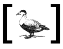

# Duck-REPL'ed

A library that transforms you REPL interactions into EQL queries. This means that it's easy to hook up a REPL eval-response, and get autocomplete, var definition, and other niceties "for free".

It'll also be used, in the future, both on Chlorine and Clover projects

## What's with the name?

It's a pun with "duck typed" - the idea that if something flies like a duck, quacks like a duck, it probably is a duck. That's the spirit of this project: if you can hook a REPL, you'll get an experience that's indistinguishable from a nREPL, or Language Server Protocol, or even static analysis. So, it's "duck-typing for REPLs" in a way.

As the idea of the project is also to be extensible, it's possible that if you hook an evaluation of another language, but somehow renders EDN, you have a clojure-like experience in a language where this would not be possible!

It's also a pun with "Pathom" and "Patão" (the [incredible library from Wilker Lúcio](https://github.com/wilkerlucio/pathom) and "duck", in Portuguese).
