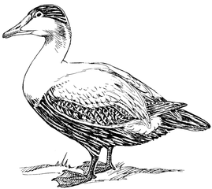

# Duck-REPL'ed

A library that transforms you REPL interactions into EQL queries. This means that it's easy to hook up a REPL eval-response, and get autocomplete, var definition, and other niceties "for free".

It'll also be used, in the future, both on Chlorine and Clover projects
